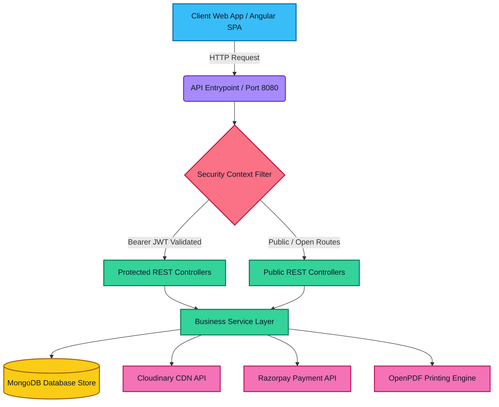
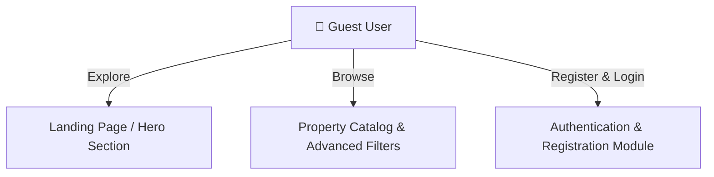
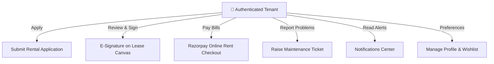
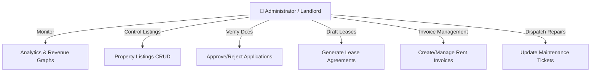
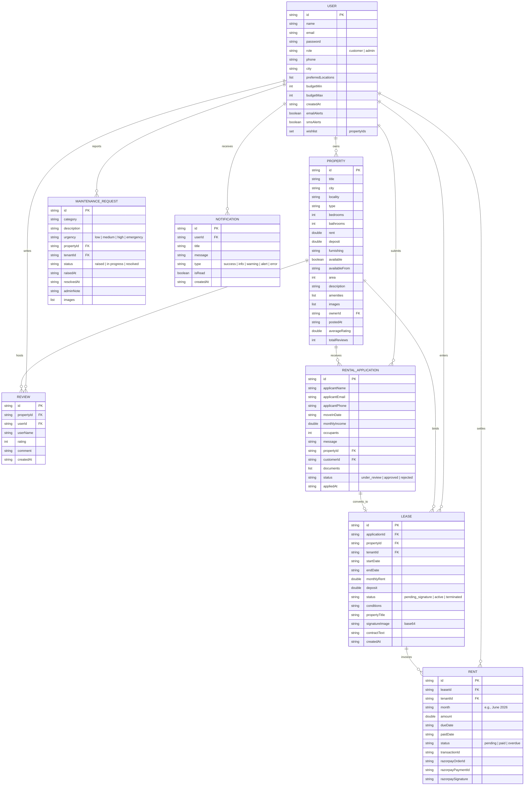

# RentEase Portal - Property Rental Management System

[](https://angular.dev/)
[](https://spring.io/projects/spring-boot)
[](https://www.mongodb.com/)
[](https://razorpay.com/)
[](https://cloudinary.com/)

RentEase Portal is a comprehensive, full-stack real estate platform engineered to automate property onboarding, lease contract signatures, automated invoice billing, online payment gateway settlement, and tenant maintenance ticketing. The system integrates a robust **Spring Boot 3 REST API Engine** (Java 21) with a highly responsive, standalone **Angular 21 Web Application** backed by a reactive **NgRx global state store**.

---

## 🌐 Live Demos & Deployment Links
* **Live Web App (Production):** []()
* **Backend API Swagger Interface:** [http://localhost:8080/swagger-ui/index.html](http://localhost:8080/swagger-ui/index.html) *(Only accessible while local backend is running)*
* **OpenAPI Specification File:** [http://localhost:8080/v3/api-docs](http://localhost:8080/v3/api-docs) *(Only accessible while local backend is running)*

---

## 📌 Table of Contents
1. [Screenshots & User Interface Walkthrough](#-screenshots--user-interface-walkthrough)
2. [Project Overview & Philosophy](#-project-overview--philosophy)
3. [Full-Stack Architecture Topology](#-full-stack-architecture-topology)
4. [Role-Based Feature Matrix](#-role-based-feature-matrix)
5. [Role-Based Use Case Diagrams](#-role-based-use-case-diagrams)
6. [Core System Workflows](#-core-system-workflows)
   - [Lease E-Signature Workflow](#lease-e-signature-workflow)
   - [Razorpay Rent Payment Lifecycle](#razorpay-rent-payment-lifecycle)
   - [Reactive NgRx State Transition Loop](#reactive-ngrx-state-transition-loop)
   - [Maintenance Repair Ticket Lifecycle](#maintenance-repair-ticket-lifecycle)
7. [Database Schema & ERD Overview](#-database-schema--erd-overview)
8. [Technology Stack & Rationales](#-technology-stack--rationales)
9. [Detailed REST API Endpoints Summary](#-detailed-rest-api-endpoints-summary)
10. [Local Environment Setup & Configuration](#-local-environment-setup--configuration)
    - [Parent Workspace Setup (.env)](#parent-workspace-setup-env)
    - [Backend Service Setup](#backend-service-setup)
    - [Frontend Web App Setup](#frontend-web-app-setup)
11. [Detailed Documentation Modules](#-detailed-documentation-modules)
12. [Contact & Support](#-contact--support)

---

## 📸 Screenshots & User Interface Walkthrough

Below are high-fidelity user interface previews demonstrating the application's key modules, designed with a premium HSL color palette, custom glassmorphism, responsive dashboard grids, and complete light/dark theme adaptation.

### Main UI Preview


> **Looking for screenshots?**
> Please check out the `/docs/screenshots/` folder in this repository for complete visual steps. Click to expand the sections below to see previews of the Tenant and Landlord workspaces.

<div style="overflow-x: auto;">
<details>
<summary><b>Click to expand: Tenant (Customer) Panel Walkthrough</b></summary>
<br>

* **Property Filter Catalog:** Browse listings with real-time budget sliders, room filters, locality searches, and availability toggles.
  
* **Property Detail & Reviews:** Extended descriptions, geographic details, reviews, and average rating computations.
  
* **Rental Application Form:** Onboarding portal where applicants upload document proof (managed by Cloudinary) and state move-in preferences.
  
* **Digital Lease signing:** Interactive base64 canvas capture designed for tenants to read contract text and attach sign proof.
  
* **Rent Transactions Ledger:** Monthly ledger checking payment histories and triggering online Razorpay checkouts.
  
* **Submit Maintenance Request:** Reporting portal for issues with photograph attachments.
  

</details>
</div>

<div style="overflow-x: auto;">
<details>
<summary><b>Click to expand: Landlord / Admin Panel Walkthrough</b></summary>
<br>

* **Property Inventory Management:** Listing creator, editor, and availability toggles.
  
* **Tenant Applications Verification:** Document inspector and status resolver.
  
* **Lease Agreements Registry:** Database tracker of active leases and signed contracts.
  
* **Rent Billing Scheduler:** Manual invoice creator for tenant accounts.
  
* **Maintenance Issues Resolution:** Dispatched contractor coordinator and note logger.
  

</details>
</div>

---

## 💡 Project Overview

The project is architected around the core goal of eliminating operational bottlenecks in residential and commercial leasing. RentEase Portal provides a secure, fully automated path from a tenant's initial search query to moving in and settling rent bills.

---

## 🔄 Architecture Topology

The application utilizes a classic Spring 3-Tier Layered Architecture (Controller -> Service -> Repository) coupled with custom Servlet security filters and third-party SaaS engines on the backend, communicating with an Angular 21 Single Page Application via REST.



---

## 🏢 Role-Based Feature Matrix

The platform dynamically adjusts UI capabilities based on active JSON Web Token roles.

| Feature Module | Guest User | Tenant (Customer) | Landlord / Admin |
| :--- | :---: | :---: | :---: |
| **Interactive Landing Page** | Read Only | View & Navigate | Dashboard Access |
| **Property Directory Catalog** | Browse / Filter | Search / Add to Wishlist | Full Inventory Control |
| **Property Review Ratings** | Read Reviews | Write & Submit Reviews | Delete / Audit Reviews |
| **Authentication & Registration** | Create Account | Read Profile Details | Audit Registered Tenants |
| **Rental Application Submission** | ✘ | Submit Forms & Income Proof | Approve / Reject Applications |
| **Digital Lease Contracts** | ✘ | Read & Sign on Canvas Pad | Create / Edit Agreement Terms |
| **Online Rent Payments** | ✘ | Razorpay Payments & Mock | View Ledger / Create Bills |
| **PDF Invoices Download** | ✘ | Download Invoice PDFs | Track and Audit Payments |
| **Maintenance Tickets** | ✘ | Raise Tickets & Upload photos | Update Status & Add notes |
| **Notification Center** | ✘ | Read personal alerts | Receive system-wide alerts |
| **Admin Stats & Charts** | ✘ | View personal expenses | Revenue & maintenance graphs |

---

## 👥 Role-Based Use Case Diagrams

The following diagrams illustrate system capabilities separated by role to ensure clean, readable layout structures:

### Guest User Use Cases


### Tenant (Customer) Use Cases


### Landlord / Admin Use Cases


---

## 🗄️ Database Schema & ERD Overview

The database structure is document-oriented (MongoDB), mapping to the following schemas:



---

## 🛠️ Technology Stack & Rationales

### Frontend Technology Stack
<div style="overflow-x: auto;">

| Library/Framework | Version | Purpose | Rationale |
| :--- | :--- | :--- | :--- |
| **Angular 21** | `21.2.0` | Core Web Architecture | Standalone elements, fast change detection, and native route structures. |
| **NgRx Store/Effects** | `21.1.1` | Global State Container | Unified event loops for clean, predictable page modifications. |
| **TypeScript** | `5.9` | Strongly Typed Script | Reduces runtime object errors and provides seamless type validation. |
| **ngx-sonner** | `3.1.0` | Alert Notification Toasts | Highly responsive visual messages without blocking UI interactions. |
| **CSS** | Standard | Visual Design | Maximum control over HSL tokens, animations, and custom theme switches. |
| **Vitest** | `4.0.8` | Component Testing runner | Sub-second testing execution speeds compared to standard Karma/Jasmine. |

</div>

### Backend Technology Stack
<div style="overflow-x: auto;">

| Library/Framework | Version | Purpose | Rationale |
| :--- | :--- | :--- | :--- |
| **Java Platform** | `21` (LTS) | Runtime Environment | High concurrency handling with virtual threads, pattern matching, and record models. |
| **Spring Boot** | `4.1.0` | REST API Server Engine | Configures MVC servlet bindings, dependency injection, and automatic configuration mapping. |
| **Spring Security** | Included | Authorization & Filter Pipelines | Handles CORS permissions, CSRF blocks, and parses incoming stateless JWT tokens. |
| **MongoDB Driver** | Included | NoSQL Database Client | High performance data retrieval with flexible schemas. |
| **JJWT (JJWT-API)** | `0.13.0` | Token Sign & Parse | Standardized cryptographic claims verification for secure API route controls. |
| **Razorpay Java SDK**| `1.4.8` | Payment Gateway Adapter | Integrates checkout processing and calculates signature checksum verifications. |
| **Cloudinary SDK** | `2.4.0` | Image Storage CDN | Dynamic asset uploads, CDN file mapping, and custom sizing features. |
| **OpenPDF** | `3.0.5` | Document PDF Drawer | Programmatic layout designer rendering styled transactional PDF invoice sheets. |
| **Lombok** | Runtime | Compile-Time Boilerplate | Automatically generates constructors, getter methods, and builder patterns. |
| **SpringDoc OpenApi**| `2.8.5` | Swagger UI Document Generator | Generates dynamic endpoint documentation pages and interactive execution testers. |

</div>

---

## Detailed REST API Endpoints Summary

### Authentication Module (`/auth`)
<div style="overflow-x: auto;">

| HTTP Method | API Path | Access Role | Description |
| :--- | :--- | :---: | :--- |
| `POST` | `/auth/register` | Public / Anonymous | Creates a new user profile inside database (defaults as `customer`). |
| `POST` | `/auth/login` | Public / Anonymous | Validates password matching and issues client JWT tokens. |

</div>

### User Module (`/users`)
<div style="overflow-x: auto;">

| HTTP Method | API Path | Access Role | Description |
| :--- | :--- | :---: | :--- |
| `GET` | `/users` | `ADMIN` only | Retrieves a list of users filtered by query param role. |
| `GET` | `/users/{id}` | Account Owner / `ADMIN` | Retrieves specific profile properties excluding credential hash. |
| `PATCH` | `/users/{id}` | Account Owner only | Partially updates settings, preferred locations, or alerts preferences. |
| `POST` | `/users/{userId}/wishlist/{propertyId}` | Account Owner only | Appends a property item to the user's saved wishlist set. |
| `DELETE` | `/users/{userId}/wishlist/{propertyId}` | Account Owner only | Removes a property item from the user's saved wishlist set. |

</div>

### Property Module (`/properties`)
<div style="overflow-x: auto;">

| HTTP Method | API Path | Access Role | Description |
| :--- | :--- | :---: | :--- |
| `GET` | `/properties` | Public / Anonymous | Searches properties using query filters (min/max budget, city, type). |
| `GET` | `/properties/{id}` | Public / Anonymous | Retrieves specific details of a property listing. |
| `POST` | `/properties` | `ADMIN` only | Inserts a new real estate inventory post with image endpoints. |
| `PATCH` | `/properties/{id}` | `ADMIN` only | Updates specifications, prices, availability, or images. |
| `DELETE` | `/properties/{id}` | `ADMIN` only | Purges a property listing record from database. |
| `GET` | `/properties/{id}/reviews` | Public / Anonymous | Fetches reviews and rating grades for the property. |
| `POST` | `/properties/{id}/reviews` | Authenticated Users | Inserts a new review rating and triggers property average recalculation. |

</div>

### Rental Application Module (`/applications`)
<div style="overflow-x: auto;">

| HTTP Method | API Path | Access Role | Description |
| :--- | :--- | :---: | :--- |
| `GET` | `/applications` | Authenticated Users | Lists applications filtered by customerId (tenant view) or propertyId (admin view). |
| `GET` | `/applications/{id}` | Authenticated Users | Retrieves detailed application variables. |
| `POST` | `/applications` | Authenticated Users | Submits a new tenancy application, flagging status as `under_review`. |
| `PATCH` | `/applications/{id}` | `ADMIN` only | Updates status (`approved` / `rejected`). Automatically toggles property availability. |
| `DELETE` | `/applications/{id}` | Authenticated Users | Deletes application records. |

</div>

### Leases Module (`/leases`)
<div style="overflow-x: auto;">

| HTTP Method | API Path | Access Role | Description |
| :--- | :--- | :---: | :--- |
| `GET` | `/leases` | Authenticated Users | Retrieves active/pending leases filtered by tenantId. |
| `GET` | `/leases/{id}` | Authenticated Users | Fetches contract text, signature files, and dates. |
| `POST` | `/leases` | `ADMIN` only | Drafts a lease agreement based on an approved application. |
| `PATCH` | `/leases/{id}` | `ADMIN` only | Modifies conditions, dates, or lease terms. |
| `POST` | `/leases/{id}/sign` | Lease Tenant only | Appends a base64 signature image, updates status to `active`, and bills rent. |

</div>

### Rent & Billing Module (`/rents`)
<div style="overflow-x: auto;">

| HTTP Method | API Path | Access Role | Description |
| :--- | :--- | :---: | :--- |
| `GET` | `/rents` | Authenticated Users | Returns a list of rent invoices filtered by tenantId and status. |
| `POST` | `/rents` | `ADMIN` / System | Creates a manual rent invoice. |
| `PATCH` | `/rents/{id}` | `ADMIN` / System | Modifies rent invoice amounts, dates, or status fields. |
| `POST` | `/rents/{id}/pay` | Authenticated Tenant | Quick mock payment endpoint flagging rents as `paid` and creating dummy `TXN-` logs. |
| `POST` | `/rents/{id}/order` | Authenticated Tenant | Binds a Razorpay transaction order ID to the rent billing record. |
| `POST` | `/rents/{id}/verify` | Authenticated Tenant | Validates HMAC-SHA-256 signatures from Razorpay and marks status as `paid`. |
| `GET` | `/rents/{id}/invoice` | Authenticated Tenant | Generates and downloads a custom styled PDF receipt file. |

</div>

### Maintenance Module (`/maintenanceRequests`)
<div style="overflow-x: auto;">

| HTTP Method | API Path | Access Role | Description |
| :--- | :--- | :---: | :--- |
| `GET` | `/maintenanceRequests` | Authenticated Users | Returns maintenance tickets filtered by tenantId. |
| `POST` | `/maintenanceRequests` | Authenticated Tenant | Files a ticket with attachments (photos), categorizing the issue. |
| `PATCH` | `/maintenanceRequests/{id}` | `ADMIN` only | Resolves tickets, updates status, and appends admin resolution notes. |

</div>

### Notifications Module (`/notifications`)
<div style="overflow-x: auto;">

| HTTP Method | API Path | Access Role | Description |
| :--- | :--- | :---: | :--- |
| `GET` | `/notifications` | Authenticated Users | Fetches system notifications matching the user ID. |
| `POST` | `/notifications` | System / `ADMIN` | Dispatches new warning/alert objects. |
| `PATCH` | `/notifications/{id}` | Authenticated Users | Toggles notification status from unread to read (`isRead` = true). |

</div>

### Media Upload Module (`/upload`)
<div style="overflow-x: auto;">

| HTTP Method | API Path | Access Role | Description |
| :--- | :--- | :---: | :--- |
| `POST` | `/upload` | Authenticated Users | Uploads files to Cloudinary and returns a secure image/file CDN URL. |

</div>

### Analytics Module (`/analytics`)
<div style="overflow-x: auto;">

| HTTP Method | API Path | Access Role | Description |
| :--- | :--- | :---: | :--- |
| `GET` | `/analytics/admin` | `ADMIN` only | Returns portal metrics (revenues, properties, maintenance, active tenants). |
| `GET` | `/analytics/customer/{userId}`| User / `ADMIN` | Returns tenant stats (total paid, active leases, complaints, expenses). |

</div>

---

## Local Environment Setup & Configuration

### Parent Workspace Setup (.env)
The project is configured to read credential imports directly from a parent folder configuration. In the **root workspace directory** (parent folder of both backend and frontend projects), create a `.env` file containing the environment settings shown below:

```properties
# System Server Port
PORT=8080

# Database Bindings
MONGODB_URI=mongodb://localhost:27017
MONGODB_DATABASE=rental_portal

# JSON Web Token Secret (Provide a secure string at least 256 bits long)
SECURITY_JWT_SECRET=YourStrongAndSecure256BitSecretKeyHereMustBeLongEnough
JWT_EXPIRATION_MS=86400000

# Cloudinary CDN Configuration (Optional: Empty fallback triggers mock Unsplash images)
CLOUDINARY_CLOUD_NAME=your_cloudinary_cloud_name
CLOUDINARY_API_KEY=your_cloudinary_api_key
CLOUDINARY_API_SECRET=your_cloudinary_api_secret

# Razorpay Payment Gateway Keys (Use test keys for development)
RAZORPAY_KEY_ID=rzp_test_YourKeyIdHere
RAZORPAY_KEY_SECRET=YourRazorpayKeySecretHere

# Multipart Files Constraints
MAX_FILE_SIZE=10MB
MAX_REQUEST_SIZE=10MB

# CORS Allowed Client Domain (Matches your frontend development URL)
FRONTEND_URL=http://localhost:4200
```

---

### 🐳 Setup Option A: Unified Containerized Setup (Docker Compose - Recommended)
You can build and spin up the database, backend services, and frontend client in a single command. 

Ensure you have created the parent `.env` file and installed Docker, then execute the following in the root workspace folder:
```bash
# Build and launch all services in the background
docker-compose up -d --build
```
This starts the following:
* **MongoDB Container:** Exposed on port `27017` with persistent volume mappings.
* **Spring Boot API Backend:** Running on host port `8080`.
* **Angular Web App:** Running on host port `4200`.

---

### 🛠️ Setup Option B: Manual Local Setup (Step-by-Step)

#### 1. Backend Service Setup

##### Prerequisites
- **JDK 21** or later installed.
- **Apache Maven 3.8+** (or use the included `./mvnw` script wrapper).
- **MongoDB** instance running locally on port `27017` (or Atlas cloud link).

##### Database Launch (Fast Docker option)
To run a local MongoDB container in the background, navigate to the parent workspace and run:
```bash
docker run -d -p 27017:27017 --name local-mongo mongo:latest
```

##### Build and Start Backend
Navigate to the backend module folder:
```bash
cd rental-portal-backend
```

Run using the Maven Wrapper:
```bash
# Windows
mvnw.cmd spring-boot:run

# Linux / MacOS
./mvnw spring-boot:run
```

On start, the backend console prints a confirmation log validating the database link:
```text
=================================================
Validating MongoDB connection...
MongoDB Connection Status: SUCCESSFUL!
=================================================
```

The server will boot on port `8080`.

#### 2. Frontend Web App Setup

##### Prerequisites
- **Node.js** v20+ or v22+ installed.
- **npm** (comes packaged with Node).

##### Install Dependencies & Start
Navigate to the frontend module folder:
```bash
cd rental-portal-frontend
npm install
```

Start the local webpack development server:
```bash
npm start
```
The application compiles and runs on [http://localhost:4200](http://localhost:4200). (Communicates with the backend API target configured in `src/app/core/global/api-service.ts`).

---

## 📁 Detailed Documentation Modules

For module-specific architecture summaries, component breakdowns, dependencies configurations, and execution guides, explore the sub-project documentation modules:

* **Backend API Engine Documentation:** See [README.md](rental-portal-backend/README.md)
* **Frontend Web Client Documentation:** See [README.md](rental-portal-frontend/README.md)

---

## 🙌 Contributing
Contributions are welcome! If you have suggestions or want to fix bugs, feel free to open a Pull Request.

## 🔗 Contact & Support
- **Developer Name:** Saksham Agrahari
- **Email:** [agrahari0899@gmail.com](mailto:agrahari0899@gmail.com)
- **GitHub Profile:** [@saksham2882](https://github.com/saksham2882)
- **LinkedIn Profile:** [@saksham-agrahari](https://www.linkedin.com/in/saksham-agrahari/)
- **Portfolio Website:** [saksham-agrahari.vercel.app](https://saksham-agrahari.vercel.app)

---
<br>

<p align="center">
  Made with ❤️ by Saksham Agrahari
</p>
