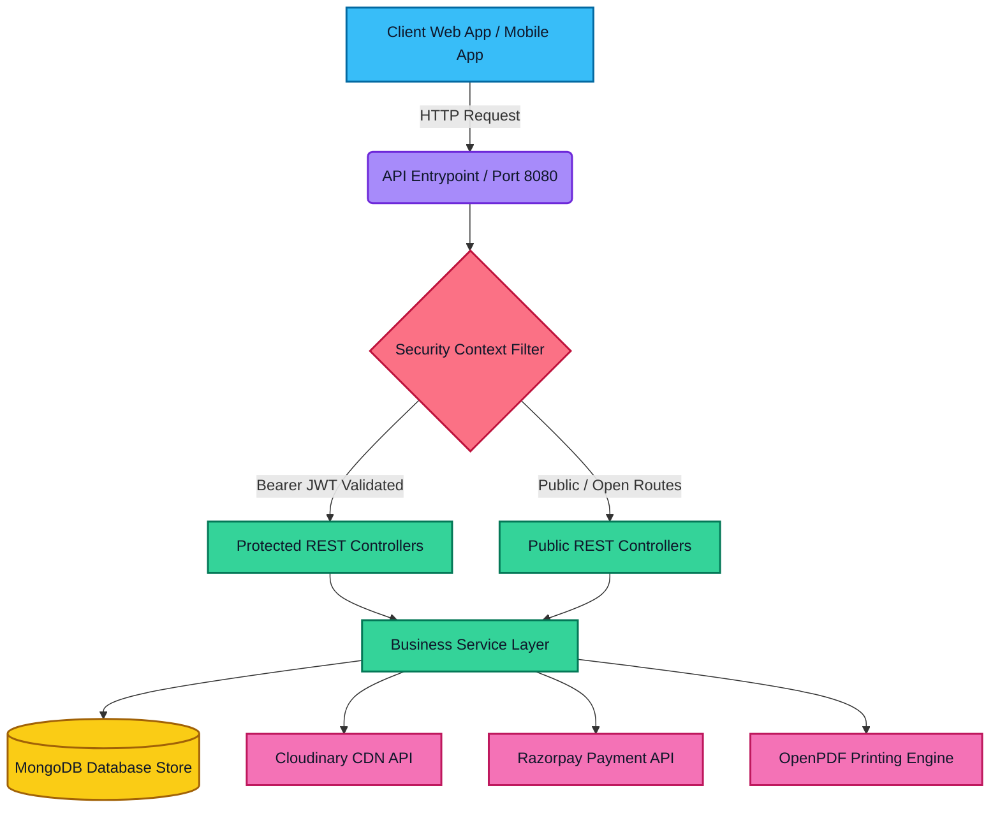
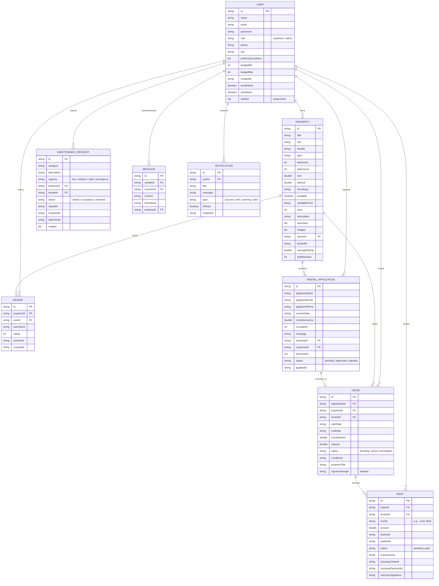
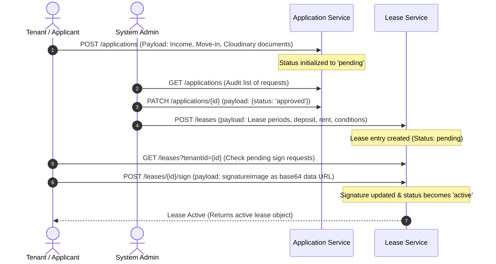
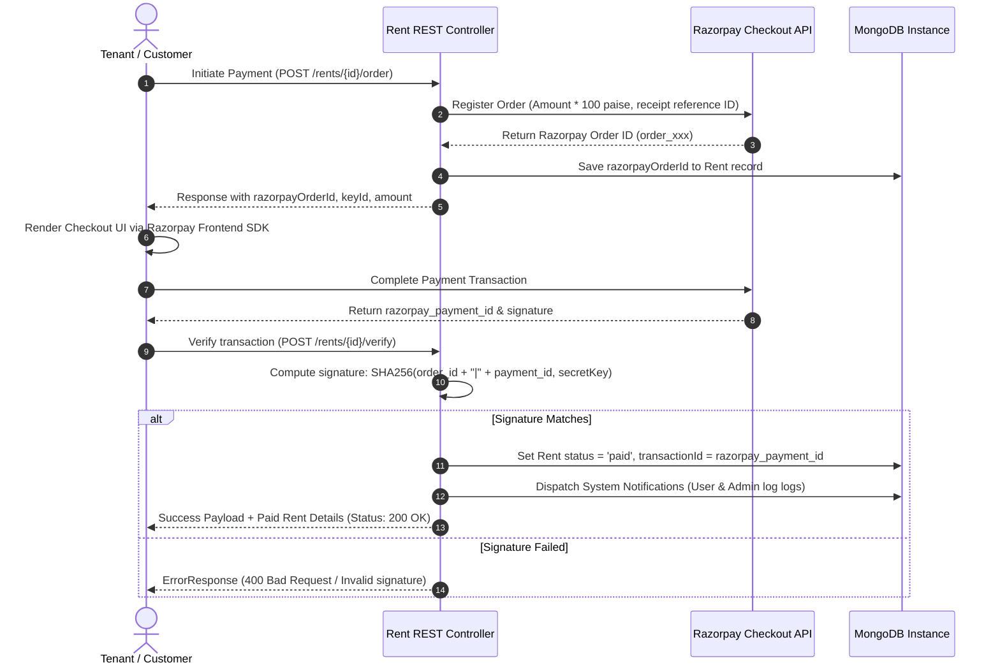

# 🏢 RentEase Portal - Backend API Engine
> **Enterprise-Grade Property Rental, Lease Agreement, & Tenant Management Service Backend**

[](https://openjdk.org/projects/jdk/21/)
[](https://spring.io/projects/spring-boot)
[](https://www.mongodb.com/)
[](https://razorpay.com/)
[](https://cloudinary.com/)

RentEase Portal Backend is a robust Spring Boot 3 rest engine engineered to power property rental platforms. It seamlessly supports key real estate processes: tenant onboarding, landlord approvals, secure electronic lease signatures, automated rent billing cycles, live payment gateway integration (Razorpay), dynamic billing invoice rendering (PDF via OpenPDF), user-to-user chatting, and system notifications.

---

## 📌 Table of Contents
1. [System Architecture & Flows](#-system-architecture--flows)
   - [Architectural Topology](#architectural-topology)
   - [Database Entity Relationship Diagram (ERD)](#database-entity-relationship-diagram-erd)
   - [Tenant Lease Workflow](#tenant-lease-workflow)
   - [Rent Payment Sequence](#rent-payment-sequence)
2. [Directory Structure](#-directory-structure)
3. [Tech Stack & Rationales](#️-tech-stack--rationales)
4. [REST API Documentation](#-rest-api-documentation)
   - [1. Authentication Module (`/auth`)](#1-authentication-module-auth)
   - [2. User Profiles & Wishlist (`/users`)](#2-user-profiles--wishlist-users)
   - [3. Property Management (`/properties`)](#3-property-management-properties)
   - [4. Applications (`/applications`)](#4-applications-applications)
   - [5. Leases (`/leases`)](#5-leases-leases)
   - [6. Rent Billing & Checkout (`/rents`)](#6-rent-billing--checkout-rents)
   - [7. Maintenance Logs (`/maintenanceRequests`)](#7-maintenance-logs-maintenancerequests)
   - [8. Messaging Engine (`/messages`)](#8-messaging-engine-messages)
   - [9. System Notifications (`/notifications`)](#9-system-notifications-notifications)
   - [10. Media Upload Upload (`/upload`)](#10-media-upload-upload)
5. [Global Security, Validation & Exception Handling](#️-global-security-validation--exception-handling)
6. [Local Setup & Installation](#-local-setup--installation)
   - [Environment Configuration](#environment-configuration)
   - [Running via Maven Wrapper](#running-via-maven-wrapper)
   - [Running via Docker Container](#running-via-docker-container)
7. [Quick Redirection Links](#-quick-redirection-links)
8. [Contact & Support](#-contact--support)

---

## 🔄 System Architecture & Flows

### Architectural Topology
The application utilizes a classic Spring 3-Tier Layered Architecture (Controller -> Service -> Repository) coupled with custom Servlet security filters and third-party SaaS engines.



### Database Entity Relationship Diagram (ERD)
The database structure is document-oriented (MongoDB), mapping to the following schemas:



### Tenant Lease Workflow
Process flow showing tenant application submission, admin verification, lease document preparation, and secure digital signing.



### Rent Payment Sequence
Process flow showing secure rent payment initialization via Razorpay SDK and automated backend verification.



---

## 📁 Directory Structure

```text
rental-portal-backend
├── Dockerfile                      # Multi-stage production container manifest
├── HELP.md                         # Reference Spring Initializr documentation
├── mvnw                            # Unix maven binary executable
├── mvnw.cmd                        # Windows cmd maven executable
├── pom.xml                         # Project Object Model dependencies list
├── src
│   ├── main
│   │   ├── java
│   │   │   └── com
│   │   │       └── rental
│   │   │           └── portal
│   │   │               ├── RentalPortalApplication.java       # Service Startup Class
│   │   │               ├── config
│   │   │               │   ├── CloudinaryConfig.java         # Cloudinary CDN credentials loader
│   │   │               │   ├── MongoConnectionValidator.java # Connection check runner on startup
│   │   │               │   ├── OpenApiConfig.java            # Swagger / OpenAPI documentation UI config
│   │   │               │   ├── RazorpayConfig.java           # Razorpay client builder bean
│   │   │               │   └── SecurityConfig.java           # Web Security, CORS mappings & CSRF config
│   │   │               ├── controller
│   │   │               │   ├── AnalyticsController.java      # Dashboard metrics builder
│   │   │               │   ├── ApplicationController.java    # Onboarding processes
│   │   │               │   ├── AuthController.java           # Authentication login/registration
│   │   │               │   ├── LeaseController.java          # Digital contracts & signatures
│   │   │               │   ├── MaintenanceController.java    # Issue tracker controller
│   │   │               │   ├── MessageController.java        # Direct user communication
│   │   │               │   ├── NotificationController.java   # Event alerting endpoints
│   │   │               │   ├── PropertyController.java       # Real estate listings & reviews
│   │   │               │   ├── RentController.java           # Payments, Orders, Receipts & Invoices
│   │   │               │   ├── UploadController.java         # Cloud media upload interface
│   │   │               │   └── UserController.java           # Wishlist & Profiles
│   │   │               ├── dto
│   │   │               │   ├── AuthResponse.java             # Auth output with JWT & User
│   │   │               │   └── LoginRequest.java             # Request inputs for user authentication
│   │   │               ├── exception
│   │   │               │   ├── BadRequestException.java      # Http status 400 mapper
│   │   │               │   ├── ConflictException.java        # Http status 409 mapper
│   │   │               │   ├── ErrorResponse.java            # Unified API Error shape DTO
│   │   │               │   ├── GlobalExceptionHandler.java   # App-wide exception interceptor
│   │   │               │   └── ResourceNotFoundException.java# Http status 404 mapper
│   │   │               ├── filter
│   │   │               │   ├── ApiLoggingFilter.java         # HTTP requests auditor
│   │   │               │   └── JwtAuthenticationFilter.java  # Token parser & Context security validator
│   │   │               ├── model
│   │   │               │   ├── Lease.java                    # Legal lease agreement schema
│   │   │               │   ├── MaintenanceRequest.java       # Tenant ticketing schema
│   │   │               │   ├── Message.java                  # Communication chat schema
│   │   │               │   ├── Notification.java             # System alerts schema
│   │   │               │   ├── Property.java                 # Property posting schema
│   │   │               │   ├── Rent.java                     # Transaction & payment cycle schema
│   │   │               │   ├── RentalApplication.java        # Pre-lease application record
│   │   │               │   ├── Review.java                   # User ratings schema
│   │   │               │   └── User.java                     # User credentials and profiles
│   │   │               ├── repository
│   │   │               │   ├── LeaseRepository.java
│   │   │               │   ├── MaintenanceRequestRepository.java
│   │   │               │   ├── MessageRepository.java
│   │   │               │   ├── NotificationRepository.java
│   │   │               │   ├── PropertyRepository.java
│   │   │               │   ├── RentRepository.java
│   │   │               │   ├── RentalApplicationRepository.java
│   │   │               │   ├── ReviewRepository.java
│   │   │               │   └── UserRepository.java
│   │   │               ├── security
│   │   │               │   ├── CustomUserDetailsService.java # Service to load user records from DB
│   │   │               │   ├── JwtTokenProvider.java         # Generator & validator utility for JWT
│   │   │               │   └── UserPrincipal.java            # UserPrincipal mapping wrapper
│   │   │               ├── service
│   │   │               │   ├── AnalyticsService.java
│   │   │               │   ├── ApplicationService.java
│   │   │               │   ├── AuthService.java
│   │   │               │   ├── LeaseService.java
│   │   │               │   ├── MaintenanceService.java
│   │   │               │   ├── MessageService.java
│   │   │               │   ├── NotificationService.java
│   │   │               │   ├── PropertyService.java
│   │   │               │   ├── RentService.java
│   │   │               │   ├── UploadService.java
│   │   │               │   └── UserService.java
│   │   │               └── util
│   │   │                   └── PdfGenerationService.java     # PDF invoice layouts drawer (OpenPDF)
│   │   └── resources
│   │       ├── application.properties                        # Variables and server bindings configs
│   │       ├── static                                        # Static public resources
│   │       └── templates                                     # Render templates directory
```

---

## 🛠️ Tech Stack & Rationales

| Library/Framework | Version | Purpose | Rationale |
| :--- | :--- | :--- | :--- |
| **Java Platform** | `21` (LTS) |  Runtime Environment | Virtual threads support, modern features, high security. |
| **Spring Boot** | `4.1.0` | Core Application Container | Bootstraps REST APIs, handles filters, data repositories and IoC container. |
| **Spring Security**| Included | Auth & RBAC Security | Secures routes, enables CORS filters, validates JWT and secures actions. |
| **MongoDB Driver**| Included | Document DB Store | Enables flexible document mapping for properties, reviews, and wishlists. |
| **Spring Validation**| Included | Bean Data Sanitization | Checks payloads on REST entries (e.g., email forms) before processing. |
| **JJWT (JJWT-API)**| `0.13.0` | JWT Generation & Verification | Generates secure digital claim tokens for state-free request control. |
| **Razorpay Java SDK**| `1.4.8` | Payment checkout processes | Native Java client supporting online order creation and secure payment hashing. |
| **Cloudinary SDK** | `2.4.0` | Image storage | Manages uploading, hosting, and optimizing image/document files in the cloud. |
| **OpenPDF** | `3.0.5` | PDF Generator Engine | Creates PDF files (receipts/invoices) programmatically using customizable fonts. |
| **Lombok** | Runtime | Boilerplate Eliminator | Generates getters, setters, builders, and constructors dynamically. |
| **SpringDoc OpenApi**| `2.8.5` | Dynamic REST OpenAPI schema | Generates interactive OpenAPI specifications and provides Swagger UI. |

---

## 🔌 REST API Documentation

### 🔑 Authorization Note
- **Public Routes:** `/auth/**`, `/error`, Swagger routes, and `GET /properties/**` are accessible anonymously.
- **Protected Routes:** All other requests require an `Authorization` header containing `Bearer <JWT_TOKEN>`.
- **Role-based Actions:** Certain mappings require specific roles (e.g., `ADMIN`) checked via `@PreAuthorize`.

---

### 1. Authentication Module (`/auth`)
Handles registration of accounts and issuance of secure JWT tokens.

#### `POST /auth/register`
* **Description:** Registers a new user account inside the database. By default, registers them as a `"customer"`.
* **Payload Request Body:**
  ```json
  {
    "name": "Rahul Sharma",
    "email": "rahul@gmail.com",
    "password": "securepassword123",
    "phone": "9876543210",
    "city": "Mumbai",
    "preferredLocations": ["Bandra", "Andheri"],
    "budgetMin": 15000,
    "budgetMax": 45000,
    "emailAlerts": true,
    "smsAlerts": false
  }
  ```
* **Success Response (200 OK):**
  ```json
  {
    "token": "eyJhbGciOiJIUzI1NiIsInR5cCI6IkpXVCJ9...",
    "user": {
      "id": "a1b2c3d4",
      "name": "Rahul Sharma",
      "email": "rahul@gmail.com",
      "password": null,
      "role": "customer",
      "phone": "9876543210",
      "city": "Mumbai",
      "preferredLocations": ["Bandra", "Andheri"],
      "budgetMin": 15000,
      "budgetMax": 45000,
      "createdAt": "2026-06-24",
      "emailAlerts": true,
      "smsAlerts": false,
      "wishlist": []
    }
  }
  ```
* **Failure Responses:**
  - `409 Conflict`: If the email address is already registered (`Email address already in use.`).

#### `POST /auth/login`
* **Description:** Authenticates user credentials and issues a JWT token.
* **Payload Request Body:**
  ```json
  {
    "email": "rahul@gmail.com",
    "password": "securepassword123"
  }
  ```
* **Success Response (200 OK):**
  ```json
  {
    "token": "eyJhbGciOiJIUzI1NiIsInR5cCI6IkpXVCJ9...",
    "user": {
      "id": "a1b2c3d4",
      "name": "Rahul Sharma",
      "email": "rahul@gmail.com",
      "password": null,
      "role": "customer",
      "phone": "9876543210",
      "city": "Mumbai",
      "preferredLocations": ["Bandra", "Andheri"],
      "budgetMin": 15000,
      "budgetMax": 45000,
      "createdAt": "2026-06-24",
      "emailAlerts": true,
      "smsAlerts": false,
      "wishlist": []
    }
  }
  ```
* **Failure Responses:**
  - `401 Unauthorized`: Bad password or invalid email (`Invalid email or password`).

---

### 2. User Profiles & Wishlist (`/users`)

#### `GET /users`
* **Role required:** `ADMIN`
* **Parameters:** `role` (Optional String filter)
* **Outcome:** Returns a list of users filtered by role.
* **Response (200 OK):** `[ { UserObj }, { UserObj } ]`

#### `GET /users/{id}`
* **Role required:** `ADMIN` or the matching account holder (`#id == authentication.principal.user.id`).
* **Outcome:** Details of the requested user.
* **Response (200 OK):** User details (excluding password hash).

#### `PATCH /users/{id}`
* **Role required:** Account holder (`#id == authentication.principal.user.id`).
* **Outcome:** Partially updates user information (e.g. alerts, preferred locations).
* **Payload:** Object containing fields to update.
* **Response (200 OK):** The updated `User` object.

#### `POST /users/{userId}/wishlist/{propertyId}`
* **Role required:** Authenticated Owner (`#userId == authentication.principal.user.id`).
* **Outcome:** Appends `propertyId` to the user's wishlist array.
* **Response (200 OK):** Void (Success).

#### `DELETE /users/{userId}/wishlist/{propertyId}`
* **Role required:** Authenticated Owner (`#userId == authentication.principal.user.id`).
* **Outcome:** Removes `propertyId` from the user's wishlist array.
* **Response (200 OK):** Void (Success).

---

### 3. Property Management (`/properties`)

#### `GET /properties`
* **Security:** Public (No authorization token required)
* **Query Parameters:**
  - `city` (String, e.g., "Mumbai")
  - `type` (String, e.g., "Apartment")
  - `bedrooms` (Integer, e.g., 2)
  - `furnishing` (String, e.g., "Semi-Furnished")
  - `available` (Boolean, e.g., true)
  - `rentMin` / `rentMax` (Double numbers)
  - `areaMin` / `areaMax` (Integer numbers)
  - `search` (String full-text keyword search against titles/localities)
* **Response (200 OK):** Array of properties matching the criteria.

#### `POST /properties`
* **Role required:** `ADMIN`
* **Description:** Registers a new property post.
* **Payload Example:**
  ```json
  {
    "title": "Stunning 2BHK Sea-Facing Flat",
    "city": "Mumbai",
    "locality": "Bandra West",
    "type": "Apartment",
    "bedrooms": 2,
    "bathrooms": 2,
    "rent": 45000.0,
    "deposit": 120000.0,
    "furnishing": "Fully Furnished",
    "available": true,
    "availableFrom": "2026-07-01",
    "area": 950,
    "description": "Premium sea-facing apartment with modern modular kitchen and 24/7 water.",
    "amenities": ["Wi-Fi", "AC", "Power Backup", "Gym", "Elevator"],
    "images": ["https://res.cloudinary.com/demo/image/upload/flat1.jpg"],
    "ownerId": "a1b2c3d4"
  }
  ```
* **Response (201 Created):** Returns created property object with generated UUID id and metadata (postedAt, ratings, reviews total counts).

#### `PATCH /properties/{id}`
* **Role required:** `ADMIN`
* **Response (200 OK):** Updated Property details.

#### `DELETE /properties/{id}`
* **Role required:** `ADMIN`
* **Response (204 No Content):** Successful deletion.

#### `GET /properties/{id}/reviews`
* **Security:** Public
* **Outcome:** Retrieve list of reviews for the property.
* **Response (200 OK):** `[ { Review }, { Review } ]`

#### `POST /properties/{id}/reviews`
* **Security:** Authenticated
* **Payload:** `{ "userId": "...", "userName": "...", "rating": 5, "comment": "Great house!" }`
* **Response (201 Created):** Created Review object. Automatically recalculates `averageRating` and `totalReviews` on the property item.

---

### 4. Applications (`/applications`)

#### `GET /applications`
* **Security:** Authenticated (returns filtered values based on query parameter)
* **Query Parameters:**
  - `customerId` (Optional String: to list user's submitted applications)
  - `propertyId` (Optional String: to list applications on a specific property)
* **Response (200 OK):** Array of rental applications.

#### `POST /applications`
* **Security:** Authenticated
* **Description:** Submits application for a property.
* **Payload Example:**
  ```json
  {
    "applicantName": "Rahul Sharma",
    "applicantEmail": "rahul@gmail.com",
    "applicantPhone": "9876543210",
    "moveInDate": "2026-07-05",
    "monthlyIncome": 95000.00,
    "occupants": 2,
    "message": "Looking forward to moving in soon.",
    "propertyId": "prop-12345",
    "customerId": "a1b2c3d4",
    "documents": ["https://res.cloudinary.com/demo/image/upload/v123/id_proof.pdf"]
  }
  ```
* **Response (201 Created):** Created Application item with state set to `"pending"`.

#### `PATCH /applications/{id}`
* **Security:** Authenticated
* **Payload:** `{ "status": "approved" }` (Updates status to approved/rejected)
* **Response (200 OK):** Updated application object.

---

### 5. Leases (`/leases`)

#### `POST /leases`
* **Security:** Authenticated (Admin action helper)
* **Description:** Generates a draft lease agreement from an approved application.
* **Payload Example:**
  ```json
  {
    "applicationId": "app-987",
    "propertyId": "prop-12345",
    "tenantId": "a1b2c3d4",
    "startDate": "2026-07-05",
    "endDate": "2027-07-04",
    "monthlyRent": 45000.0,
    "deposit": 120000.0,
    "conditions": "Tenancy rules and terms of maintenance agreements.",
    "propertyTitle": "Stunning 2BHK Sea-Facing Flat"
  }
  ```
* **Response (201 Created):** New lease in state `"pending"`.

#### `POST /leases/{id}/sign`
* **Security:** Authenticated (Tenant signature action)
* **Payload:** `{ "signatureImage": "data:image/png;base64,iVBORw0KGgoAAAANS..." }`
* **Description:** Appends base64 signature image. Transition status from `"pending"` to `"active"`.
* **Response (200 OK):** Active signed lease details.

---

### 6. Rent Billing & Checkout (`/rents`)

#### `GET /rents`
* **Query Parameters:**
  - `tenantId` (Optional tenant filter)
  - `status` (Optional status filter: `pending | paid`)
* **Response (200 OK):** `[ { Rent }, { Rent } ]`

#### `POST /rents/{id}/pay`
* **Description:** Mock payment endpoint that immediately flags the rent as `paid` and assigns a dummy transactional ID prefix `TXN-xxxx`.
* **Response (200 OK):** Paid Rent object.

#### `POST /rents/{id}/order`
* **Description:** Registers a formal checkout sequence with Razorpay.
* **Outcome:** Invokes Razorpay Orders API, binds the generated `razorpayOrderId` to the Rent record, and sends checkout parameters back.
* **Response (200 OK):**
  ```json
  {
    "razorpayOrderId": "order_OG72hdy8dHs9",
    "amount": 4500000,
    "currency": "INR",
    "keyId": "rzp_test_YourKeyHere"
  }
  ```

#### `POST /rents/{id}/verify`
* **Description:** Verifies payment transaction status using HMAC-SHA-256 validation.
* **Payload Example:**
  ```json
  {
    "razorpay_order_id": "order_OG72hdy8dHs9",
    "razorpay_payment_id": "pay_PH823jds83Hd",
    "razorpay_signature": "6e9bc837d7a7b8e1f0e49..."
  }
  ```
* **Outcome:** Validates payload hash using secret key. On success, updates Rent record to status `"paid"`, stores transactional identifiers, and logs notifications.
* **Response (200 OK):** Settled Rent record object.

#### `GET /rents/{id}/invoice`
* **Description:** Downloads receipt for the paid rent.
* **Response Content-Type:** `application/pdf`
* **Outcome:** Returns a beautifully compiled PDF invoice document (with structured tables, billing detail cards, and a green "SECURELY PAID / RAZORPAY VERIFIED" watermark stamp) directly to the browser for download.

---

### 7. Maintenance Tickets (`/maintenanceRequests`)

#### `GET /maintenanceRequests`
* **Query Parameters:** `tenantId` (Optional filter)
* **Response (200 OK):** `[ { MaintenanceRequest }, { MaintenanceRequest } ]`

#### `POST /maintenanceRequests`
* **Description:** Raises a new maintenance ticket for repair issues.
* **Payload Example:**
  ```json
  {
    "category": "Plumbing",
    "description": "Kitchen sink leakage. Water keeps dripping continuously.",
    "urgency": "medium",
    "propertyId": "prop-12345",
    "tenantId": "a1b2c3d4",
    "images": ["https://res.cloudinary.com/demo/image/upload/v123/leakage.jpg"]
  }
  ```
* **Response (201 Created):** Maintenance request with status initialized to `"raised"`.

#### `PATCH /maintenanceRequests/{id}`
* **Role required:** `ADMIN`
* **Payload Example:**
  ```json
  {
    "status": "resolved",
    "adminNote": "Plumber visited on 2026-06-25 and replaced the main washer."
  }
  ```
* **Response (200 OK):** Updated request indicating resolved status and resolution timestamp.

---

### 8. Messaging Engine (`/messages`)

#### `GET /messages`
* **Query Parameters:**
  - `user1` (String userId)
  - `user2` (String userId)
* **Outcome:** Returns the chat history between the two users.
* **Response (200 OK):** List of messages sorted by timestamp.

#### `POST /messages`
* **Payload:** `{ "senderId": "...", "receiverId": "...", "content": "Hello", "propertyId": "..." }`
* **Response (201 Created):** Saved Message object.

---

### 9. System Notifications (`/notifications`)

#### `GET /notifications`
* **Query Parameters:** `userId` (Optional filter)
* **Response (200 OK):** List of notifications matching the user.

#### `POST /notifications`
* **Payload:** `{ "userId": "...", "title": "System Alert", "message": "...", "type": "info" }`
* **Response (201 Created):** Created notification object with `isRead` set to `false`.

#### `PATCH /notifications/{id}`
* **Payload:** `{ "isRead": true }`
* **Response (200 OK):** Updated Notification object (marks as read).

---

### 10. Media Upload (`/upload`)

#### `POST /upload`
* **Request Content-Type:** `multipart/form-data`
* **Body Form Parameters:**
  - `file`: Multipart File (Allowed: JPEG, PNG, PDF, DOCX up to limit)
* **Outcome:** Uploads the binary stream to Cloudinary storage.
* **Response (200 OK):**
  ```json
  {
    "url": "https://res.cloudinary.com/cloudinary_cloud_name/image/upload/v171926/hash_name.pdf"
  }
  ```

---

## 🛡️ Global Security, Validation & Exception Handling

### Security Authentication Lifecycle
All protected API requests undergo dynamic verification in the backend pipelines:
1. `JwtAuthenticationFilter` intercepts requests and extracts the `Authorization` header token.
2. Checks token validity using the cryptographically verified HMAC-SHA256 `jwtSecretKey`.
3. Loads user context and maps it to a `UserPrincipal` context inside Spring Security's `SecurityContextHolder`.

### Global Exception Interception
The **GlobalExceptionHandler** translates uncaught system exceptions into a standardized API payload error format:

```json
{
  "timestamp": "2026-06-24T03:38:22.124Z",
  "status": 404,
  "error": "Not Found",
  "message": "Rent record not found",
  "path": "/rents/rent-999/invoice"
}
```

#### Exception Resolution Reference Table
| Backend Class | Captured Event | Mapped HTTP Code | Sample Output Message |
| :--- | :--- | :--- | :--- |
| `ResourceNotFoundException` | Missing records in DB | `404 Not Found` | *Object not found* |
| `ConflictException` | Double payments / email clashes | `409 Conflict` | *Email address already in use.* |
| `BadRequestException` | Missing verification parameters | `400 Bad Request` | *Missing payment parameters* |
| `MethodArgumentNotValidException` | Validation failures on payloads | `400 Bad Request` | *Validation failed: email is invalid* |
| `AccessDeniedException` | User permissions role mismatch | `403 Forbidden` | *Access Denied: Access is denied* |
| `Exception` | Generic unhandled errors | `500 Server Error` | *An unexpected error occurred...* |

---

## 🚀 Local Setup & Installation

### Prerequisites
Make sure you have installed:
- **Java Development Kit (JDK) 21** or later.
- **Apache Maven 3.8+** (or use the packaged `./mvnw` binary script wrapper).
- **MongoDB** instance (Local instance or MongoDB Atlas Cloud database).
- **Cloudinary** developer account.
- **Razorpay** merchant account in Test Mode.

---

### Environment Configuration
The backend application loads configurations dynamically using environment variables. Create a `.env` file in the **parent directory** of the backend project repository, or specify them in your environment shell:

```properties
# System Server Port
PORT=8080

# Database Bindings
MONGODB_URI=mongodb://localhost:27017
MONGODB_DATABASE=rental_portal

# JSON Web Token Secret (Provide a secure string at least 256 bits long)
SECURITY_JWT_SECRET=YourStrongAndSecure256BitSecretKeyHereMustBeLongEnough
JWT_EXPIRATION_MS=86400000

# Cloudinary CDN Configuration
CLOUDINARY_CLOUD_NAME=your_cloudinary_cloud_name
CLOUDINARY_API_KEY=your_cloudinary_api_key
CLOUDINARY_API_SECRET=your_cloudinary_api_secret

# Razorpay Payment Gateway Keys (Use test keys for development)
RAZORPAY_KEY_ID=rzp_test_YourKeyIdHere
RAZORPAY_KEY_SECRET=YourRazorpayKeySecretHere

# Multipart Files Constraints
MAX_FILE_SIZE=10MB
MAX_REQUEST_SIZE=10MB

# CORS Allowed Client Domain (Matches your frontend URL)
FRONTEND_URL=http://localhost:4200
```

*Note: The **application.properties** loads values directly from this file on startup through `spring.config.import=optional:file:../.env[.properties]`.*

---

### Running via Maven Wrapper

#### 1. Test database connection
Start your local MongoDB instance. If running in a Docker sandbox, execute:
```bash
docker run -d -p 27017:27017 --name local-mongo mongo:latest
```

#### 2. Run application
Execute compilation and start the application locally:
```bash
# Windows
mvnw.cmd spring-boot:run

# Linux / MacOS
./mvnw spring-boot:run
```

The system will start, and the console will print a successful MongoDB connection confirmation logs thanks to `MongoConnectionValidator`:
```text
=================================================
Validating MongoDB connection...
MongoDB Connection Status: SUCCESSFUL!
=================================================
```

---

### Running via Docker Container
You can containerize the app using the multi-stage **Dockerfile** included in the root folder.

#### 1. Compile & Build the Image
```bash
docker build -t rental-portal-backend:latest .
```

#### 2. Run the Container (passing environment parameters)
```bash
docker run -d \
  -p 8080:8080 \
  --env-file ../.env \
  --name rental-backend \
  rental-portal-backend:latest
```

---

## 🔗 Quick Redirection Links
- **Spring Initializr Configuration Reference Guides:**
  - View **HELP.md** for official Spring Guides links (Security, LDAP, Validation, Web, and Mongo).
- **Interactive Swagger REST UI:**
  - URL: [http://localhost:8080/swagger-ui/index.html](http://localhost:8080/swagger-ui/index.html) *(Only accessible while application is running)*
- **OpenAPI Schema Specification File:**
  - URL: [http://localhost:8080/v3/api-docs](http://localhost:8080/v3/api-docs) *(Only accessible while application is running)*

---

## 🙌 Contributing

Contributions are welcome! If you have any ideas, suggestions, or bug reports, please open an issue or create a pull request.

## 🔗Contact Me

- **Email:** [agrahari0899@gmail.com](mailto:agrahari0899@gmail.com)
- **GitHub:** [@saksham2882](https://github.com/saksham2882)
- **LinkedIn:** [@saksham-agrahari](https://www.linkedin.com/in/saksham-agrahari/)
- **Portfolio:** [saksham-agrahari.vercel.app](https://saksham-agrahari.vercel.app)

---
<br>

<p align="center">
  Made with ❤️ by Saksham Agrahari
</p>
