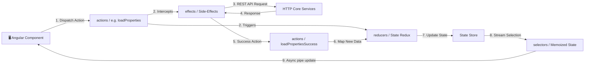
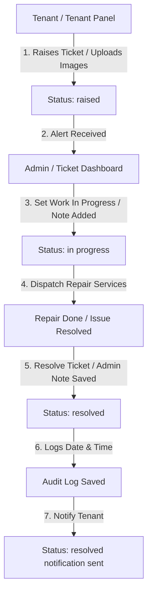
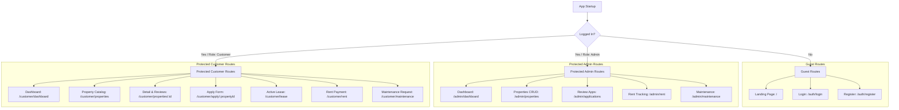

# 💻 RentEase Portal - Frontend Web App
> **Enterprise-Grade Property Rental, Lease Signing, Rent Checkout, & Maintenance Dashboard Client**

[](https://angular.dev/)
[](https://www.typescriptlang.org/)
[](https://ngrx.io/)
[](https://vitest.dev/)
[](https://github.com/ngx-sonner/ngx-sonner)

RentEase Portal Frontend is a modern, responsive single-page application (SPA) built with Angular 21. Powered by a centralized state container (NgRx), the portal offers a smooth and responsive user experience for landlords, admins, and tenants. It features responsive layouts, real-time toast notifications, secure route guards, performance caching, dynamic loaders, and complete light/dark theme support.

---

## 📌 Table of Contents
1. [User Interface Design System](#-user-interface-design-system)
2. [Functional Feature Matrix](#-functional-feature-matrix)
3. [Architecture & Design Patterns](#-architecture--design-patterns)
   - [Core Architecture Layout](#core-architecture-layout)
   - [Centralized State Management (NgRx)](#centralized-state-management-ngrx)
   - [HTTP Request Interception Lifecycle](#http-request-interception-lifecycle)
4. [Role-Based Use Case Diagrams](#-role-based-use-case-diagrams)
5. [System Workflow Diagrams](#-system-workflow-diagrams)
   - [Rent Payment Lifecycle](#rent-payment-lifecycle)
   - [Maintenance Ticket Lifecycle](#maintenance-ticket-lifecycle)
6. [Routing & Navigation Flow](#-routing--navigation-flow)
7. [Directory Structure](#-directory-structure)
8. [Tech Stack & Libraries](#️-tech-stack--libraries)
9. [Local Setup & Installation](#-local-setup--installation)
10. [Production Build & Tests](#-production-build--tests)
11. [Contact & Support](#-contact--support)

---

## User Interface Design System
The frontend implements a curated design system directly via CSS Variables (`styles.css`), providing fluid themes, smooth transitions, and premium components without the bloat of third-party CSS frameworks.

* **Typography:** Premium Google Fonts (`Plus Jakarta Sans` for body text, `Sora` for prominent display headers, and `Inter` for interface elements).
* **Color Palette:** Tailored HSL colors, featuring a professional Indigo primary brand theme, refreshing Teal accents, and clean support statuses (emerald greens, amber warnings, and rose reds).
* **Dark Mode (`[data-theme="dark"]`):** Complete dark theme mappings utilizing custom dark colors, glowing borders, and glassmorphic card configurations.
* **Layout Utilities:** Fluid spacing grids (`--space-1` to `--space-24`), dynamic border radius tokens (`--radius-sm` to `--radius-xl`), and multi-tier drop-shadow overlays.

---

## Functional Feature Matrix

### 👤 Guest / Public Actions
* **Interactive Landing Page:** Explore modern search sliders, property statistics, verified customer reviews, and general onboarding directions.
* **Advanced Catalog Filtering:** Filter through properties in real-time by city, configuration (bedrooms/bathrooms), budget range, area range, furnishing status, and full-text keywords.
* **Property Details & Reviews:** View comprehensive property images, descriptions, pricing breakdowns, amenities, and user-submitted feedback (including dynamically computed average ratings).

### 🔑 Authentication & Profiles
* **JWT Authentication:** Simple Register/Login with client-side form validation.
* **Profile Settings:** Custom preferences for city alerts, preferred rental locations, budget boundaries, and toggles for Email/SMS notification dispatch.
* **Wishlist Management:** One-click wishlist save system to aggregate preferred properties directly under the profile page.

### 🏠 Tenant Panel (Customer Module)
* **Application Submission:** Submit rental applications containing move-in dates, monthly income verification, occupant count, and attachment uploads (PDFs, images) managed by Cloudinary.
* **Digital Lease Signatures:** Review administrative lease details and digitally sign contracts using an interactive base64 image capture canvas.
* **Payment checkout & Receipts:** Pay rent invoices securely using Razorpay gateway integration (including a Developer mock payment fallback) and download beautifully structured PDF invoice receipts dynamically generated from the backend.
* **Maintenance Ticketing:** Lodge plumbing, electrical, or structural repair tickets complete with textual descriptions, urgency ratings (low to emergency), and visual photographic evidence.
* **Notifications Hub:** Real-time event notifications for invoice updates, application progress, and lease approvals.

### 🏢 Landlord / Administration Panel
* **Admin Dashboard Analytics:** Analyze overall portal data with real-time analytics graphs including properties occupied, revenue projections, pending reviews, and open maintenance tickets.
* **Property Management (CRUD):** Complete control to add, edit, or delete property listings, upload multiple gallery images, and adjust availability.
* **Application Audit & Approval:** Evaluate tenant documents and income details, approving or rejecting applications with instant automated system notifications.
* **Lease Issuance:** Convert approved application variables into draft leases, setting start/end dates, conditions, and contract terms.
* **Rent & Issue Tracking:** Generate rent bills manually, verify checkout signatures, audit logs, and coordinate plumber/electrician dispatches to resolve tenant tickets.

---

## Architecture & Design Patterns

### Core Architecture Layout
The application follows a clean, modular structure split into logical responsibilities:
```text
  Client App
      │
      ├── [Core Module]          <-- Guards, API Wrappers, Shared Models, & HTTP Interceptors
      │
      ├── [Features Module]      <-- Isolated Lazy-Loaded Views (Admin, Customer, Landing Page)
      │
      ├── [Shared Module]        <-- Reusable UI Components (Navbar, Footer, Modals, Spinners), Directives, & Pipes
      │
      └── [Store State Module]   <-- Global NgRx State management
```

### Centralized State Management (NgRx)
To ensure reliable, predictable data flow, all key business domains are managed using NgRx:
* **Actions:** Explicitly declare state events (e.g., `loadProperties`, `payRentSuccess`, `loginFailure`).
* **Reducers:** Pure functions mapping state transitions without side-effects.
* **Selectors:** High-performance, memoized queries to stream slices of store state to UI components.
* **Effects:** Side-effect middleware that intercepts actions, triggers HTTP queries to services, and dispatches success/error actions upon completion.

The store is split into seven domain state slices: `auth`, `properties`, `applications`, `leases`, `maintenance`, `rent`, and `notifications`.

#### NgRx Store Configuration
<div style="overflow-x: auto;">

| State Slice | Managed Model / Entity | Primary Actions | Core State Fields |
| :--- | :--- | :--- | :--- |
| **`auth`** | User | `login`, `loginSuccess`, `loginFailure`, `logout`, `updateProfile` | `user`, `token`, `loading`, `error` |
| **`properties`** | Property | `loadProperties`, `loadPropertiesSuccess`, `createProperty`, `updateProperty` | `entities`, `loading`, `error`, `selectedId` |
| **`applications`** | RentalApplication | `loadApplications`, `submitApplication`, `updateApplicationStatus` | `entities`, `loading`, `error` |
| **`leases`** | Lease | `loadLease`, `createLease`, `signLease`, `signLeaseSuccess` | `lease`, `loading`, `error` |
| **`rent`** | Rent | `loadRents`, `createRent`, `initiatePayment`, `verifyPayment` | `entities`, `loading`, `error` |
| **`maintenance`** | MaintenanceRequest | `loadRequests`, `submitRequest`, `updateRequestStatus` | `entities`, `loading`, `error` |
| **`notifications`** | Notification | `loadNotifications`, `markAsRead`, `addNotification` | `entities`, `loading`, `error` |

</div>

### HTTP Request Interception Lifecycle
All outgoing requests are intercepted and enriched via dynamic Angular Functional Interceptors:

1. **`authInterceptor`:** Checks local storage for a valid JWT token, injecting it as an `Authorization: Bearer <token>` header. Additionally, if the backend returns a `401 Unauthorized` or `403 Forbidden` response, it automatically dispatches a store `logout()` action to securely purge the session.
2. **`cacheInterceptor`:** Optimizes network load by locally caching read-only GET queries for `/properties`, `/leases`, and `/rents`. If a user makes a mutating request (POST, PATCH, DELETE), the cache is automatically invalidated to guarantee fresh data representation.
3. **`loaderInterceptor`:** Tracks mutating HTTP transactions to toggle a global page loading indicator, preventing double-clicks and enhancing overall user responsiveness.

---

## Role-Based Use Case Diagrams

The following diagram illustrates system capabilities mapped across Guest, Tenant (Customer), and Landlord/Admin actors:

```mermaid
flowchart TD
    subgraph Roles
        Guest[👤 Guest User]
        Customer[🔑 Authenticated Tenant]
        Admin[🏢 Administrator / Landlord]
    end

    subgraph Guest Actions
        Guest -->|Explore| Landing[Landing Page / Hero Section]
        Guest -->|Browse| Search[Property Catalog & Filters]
        Guest -->|Register/Login| Auth[Authentication Module]
    end

    subgraph Tenant Actions
        Customer -->|Apply| AppSubmit[Submit Rental Application]
        Customer -->|Review & Sign| LeaseSign[E-Signature on Lease Canvas]
        Customer -->|Pay Bills| PayRent[Razorpay Online Rent Checkout]
        Customer -->|Report Problems| MainReq[Raise Maintenance Ticket]
        Customer -->|Read Alerts| Alerts[Notifications Center]
        Customer -->|Preferences| Profile[Manage Profile & Wishlist]
    end

    subgraph Admin Actions
        Admin -->|Monitor| AdminDash[Analytics & Revenue Graphs]
        Admin -->|Control Listings| PropertyCRUD[Property Listings CRUD]
        Admin -->|Verify Docs| AppAudit[Approve/Reject Applications]
        Admin -->|Draft Leases| LeaseGen[Generate Lease Agreements]
        Admin -->|Invoice Management| RentBill[Create/Manage Rent Invoices]
        Admin -->|Dispatch Repairs| ResolveMain[Update Maintenance Tickets]
    end
```



---

## System Workflow Diagrams

### NgRx State Transition Workflow
This flowchart outlines the reactive data architecture where state is updated predictably following components actions:



### Rent Payment Lifecycle
Process showing the step-by-step transaction flow from ordering to invoice generation:

```mermaid
flowchart TD
    Start[Invoice Due] -->|1. POST /rents/{id}/order| Order[Create Razorpay Order]
    Order -->|2. Binds razorpayOrderId| SaveDB[Store Order in DB]
    SaveDB -->|3. Checkout Parameters Sent| RenderSDK[Render Razorpay Checkout UI]
    RenderSDK -->|4. Complete Transaction| ProcessPayment[Razorpay Gateway Processing]
    ProcessPayment -->|5. Success Payload Returned| Verify[POST /rents/{id}/verify]
    
    subgraph Signature Validation
        Verify -->|6. Calculate HMAC-SHA-256| CheckSig{Signature Valid?}
    end
    
    CheckSig -->|No| Fail[Return 400 Bad Request]
    CheckSig -->|Yes| Settle[Set Rent Status: 'paid' & Binds Transaction Details]
    Settle -->|7. Generate Invoices| PdfGen[OpenPDF Renders Receipt Layout]
    PdfGen -->|8. Notify User & Admin| Notification[System Alerts Dispatched]
```

### Maintenance Ticket Lifecycle
Lifecycle workflow of tenant complaints resolved by administrators:



---

## Routing & Navigation Flow
Routes are secured using role-based guards, lazy-loading components on demand to optimize initial load times.



### Routing Matrix
<div style="overflow-x: auto;">

| Route Path | Module / Component | Target Role | Access Security | Active Route Guards | Description |
| :--- | :--- | :--- | :--- | :--- | :--- |
| `/` | `LandingPageComponent` | Public / Guest | Anonymous | `redirectIfLoggedInGuard` | Core homepage containing property highlights and general statistics. |
| `/auth/login` | `LoginComponent` | Public / Guest | Anonymous | `redirectIfLoggedInGuard` | Credential input form validating registered profiles. |
| `/auth/register` | `RegisterComponent` | Public / Guest | Anonymous | `redirectIfLoggedInGuard` | Profile creation page capturing preferences and alert boundaries. |
| `/customer/dashboard` | `DashboardComponent` | Customer / Tenant | Authenticated | `customerGuard` | Summary dashboard displaying active lease count, total paid, and quick actions. |
| `/customer/properties` | `PropertyCatalogComponent` | Customer / Tenant | Authenticated | `customerGuard` | Advanced property catalog with sliders, filters, and keyword search. |
| `/customer/properties/:id` | `PropertyDetailComponent` | Customer / Tenant | Authenticated | `customerGuard` | Comprehensive property visual gallery, descriptions, reviews, and submission panel. |
| `/customer/apply/:propertyId` | `ApplyComponent` | Customer / Tenant | Authenticated | `customerGuard`, `confirmLeaveGuard` | Document submission and lease onboarding application form. |
| `/customer/lease` | `LeaseDetailComponent` | Customer / Tenant | Authenticated | `customerGuard` | Contract detail view and signature canvas for digital leases. |
| `/customer/rent` | `RentTrackingComponent` | Customer / Tenant | Authenticated | `customerGuard` | Invoice ledger showing transaction records and triggering Razorpay checkouts. |
| `/customer/maintenance` | `MaintenanceComponent` | Customer / Tenant | Authenticated | `customerGuard` | Reporting center to raise tickets, upload photographs, and track status. |
| `/admin/dashboard` | `AdminDashboardComponent` | System Admin | Authenticated | `adminGuard` | Overall metrics panel showcasing occupancy charts, revenue curves, and request queues. |
| `/admin/properties` | `PropertyManagementComponent` | System Admin | Authenticated | `adminGuard`, `confirmLeaveGuard` | Administration panel to create, update, or delete property listings. |
| `/admin/applications` | `ApplicationReviewComponent` | System Admin | Authenticated | `adminGuard` | Audit list to review tenant documents and change status to approved/rejected. |
| `/admin/tenants` | `TenantManagementComponent` | System Admin | Authenticated | `adminGuard` | Leases directory tracking signed agreements and rental periods. |
| `/admin/rent` | `RentManagementComponent` | System Admin | Authenticated | `adminGuard` | Billing interface to generate monthly invoices, audit receipts, and check transaction logs. |
| `/admin/maintenance` | `MaintenanceManagementComponent` | System Admin | Authenticated | `adminGuard`, `confirmLeaveGuard` | Dispatched ticket resolution system and admin note registrar. |

</div>

---

## Directory Structure

```text
rental-portal-frontend
├── src
│   ├── main.ts                       # App Bootstrap Entrypoint
│   ├── index.html                    # Single Page Wrapper
│   ├── styles.css                    # Design System, CSS variables, & Global layouts
│   └── app
│       ├── app.ts                    # Root App Component
│       ├── app.html                  # Root Component HTML Markup
│       ├── app.css                   # Root Component Specific Styles
│       ├── app.config.ts             # Store registration, routing, and HTTP configuration
│       ├── app.routes.ts             # Route configurations & Lazy-Loading definitions
│       ├── core
│       │   ├── global
│       │   │   ├── api-service.ts    # Generic RxJS HTTP clients wrapper
│       │   │   └── logger-service.ts # Core Console logger helper
│       │   ├── guards
│       │   │   ├── admin-guard.ts    # Restricts page access to ADMIN role
│       │   │   ├── auth-guard.ts     # Redirects logged-in users away from /login
│       │   │   ├── customer-guard.ts # Restricts page access to CUSTOMER role
│       │   │   └── unsaved-changes.ts# Prompts user warning on dirty form exit
│       │   ├── interceptor
│       │   │   ├── auth-interceptor.ts
│       │   │   ├── cache-interceptor.ts
│       │   │   └── loader-interceptor.ts
│       │   ├── models
│       │   │   ├── user-model.ts
│       │   │   ├── property-model.ts
│       │   │   ├── lease-model.ts
│       │   │   ├── rent-model.ts
│       │   │   ├── maintenance-model.ts
│       │   │   └── application-model.ts
│       │   └── services
│       │       ├── auth-service.ts
│       │       ├── property-service.ts
│       │       ├── lease-service.ts
│       │       ├── rent-service.ts
│       │       ├── maintenance-service.ts
│       │       └── toast-service.ts   # ngx-sonner toaster portal
│       ├── shared
│       │   ├── components
│       │   │   ├── navbar
│       │   │   ├── footer
│       │   │   ├── dropdown
│       │   │   ├── modal
│       │   │   └── loading-spinner
│       │   ├── directives
│       │   │   └── click-outside-directive.ts
│       │   └── pipes
│       │       ├── price-format-pipe.ts
│       │       └── relative-time-pipe.ts
│       ├── features
│       │   ├── landing-page
│       │   ├── auth
│       │   │   ├── login
│       │   │   └── register
│       │   ├── customer
│       │   │   ├── dashboard
│       │   │   ├── property-catalog
│       │   │   ├── property-detail
│       │   │   ├── rental-application
│       │   │   ├── lease-detail
│       │   │   ├── rent-tracking
│       │   │   └── maintenance
│       │   └── admin
│       │       ├── dashboard
│       │       ├── property-management
│       │       ├── application-review
│       │       ├── tenant-management
│       │       ├── rent-management
│       │       └── maintenance-management
│       └── store
│           ├── auth                   # Auth actions, reducers, effects, selectors
│           ├── properties             # Properties actions, reducers, effects
│           ├── applications           # Applications actions, reducers, effects
│           ├── leases                 # Leases actions, reducers, effects
│           ├── rent                   # Rent actions, reducers, effects
│           ├── maintenance            # Maintenance actions, reducers, effects
│           └── notifications          # Notifications actions, reducers, effects
```

---

## Tech Stack & Libraries
* **Framework:** Angular 21 (v21.2.0) with Standalone Components & Routing.
* **State Management:** NgRx Store, Effects, and Entities (v21.1.1).
* **Toast Messaging:** `ngx-sonner` (v3.1.0) providing slick, customizable micro-alerts.
* **Icons:** Dynamic SVG icon integration.
* **Development & Formatting:** Prettier, EditorConfig.
* **Unit Testing:** Vitest (v4.0.8) and jsdom (v28.0.0).

---

## Local Setup & Installation

### 1. Project Dependencies Installation
Clone the repository, navigate to the frontend folder, and install all package configurations:
```bash
cd rental-portal-frontend
npm install
```

### 2. Configure Backend API Target
Open `src/app/core/global/api-service.ts` and modify `baseUrl` to point to your running Spring Boot server instance (Default: `http://localhost:8080`).

### 3. Run Development Server
Start the local webpack dev server:
```bash
npm start
```
The application will launch and compile. Navigate to [http://localhost:4200](http://localhost:4200) in your web browser.

---

## Production Build & Tests

### Production Compilation
To build and optimize the project bundles for active production hosting:
```bash
npm run build
```
Compiled static assets will be outputted to the `dist/` directory.

### Running Unit Tests
To execute frontend specs with the Vitest testing runner:
```bash
npm run test
```

---

## 🙌 Contributing
Contributions are welcome! Feel free to raise issues, propose improvements, or submit pull requests.

## 🔗 Contact Me
- **Email:** [agrahari0899@gmail.com](mailto:agrahari0899@gmail.com)
- **GitHub:** [@saksham2882](https://github.com/saksham2882)
- **LinkedIn:** [@saksham-agrahari](https://www.linkedin.com/in/saksham-agrahari/)
- **Portfolio:** [saksham-agrahari.vercel.app](https://saksham-agrahari.vercel.app)

---
<br>

<p align="center">
  Made with ❤️ by Saksham Agrahari
</p>
